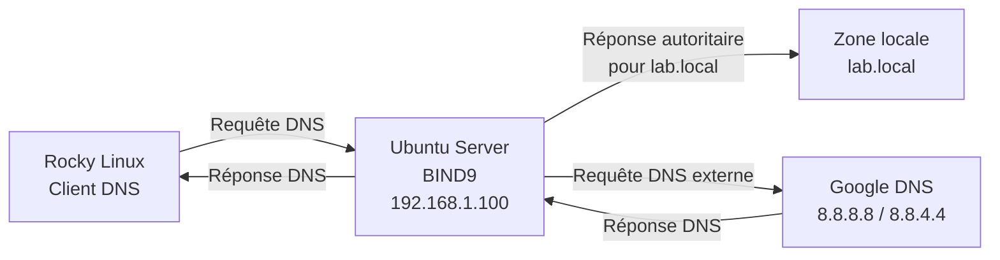

# Lab DNS avec BIND9

## 📌 Contexte

Mise en place d'un serveur DNS sous **Ubuntu Server (192.168.1.100)** jouant un double rôle :

* **Serveur DNS autoritaire** pour le domaine local `lab.local`
* **Serveur DNS récursif** pour résoudre les noms de domaine externes pour les machines du réseau

Une machine **Rocky Linux** a été utilisée comme client de test. Elle a été configurée pour utiliser le serveur DNS Ubuntu afin de valider la résolution de noms avec des outils comme `dig` et un navigateur web.

---

## 🖥️ Architecture



### Fonctionnement

Le serveur Ubuntu avec BIND9 joue deux rôles :

* **Autoritaire** : lorsqu'un client demande un nom appartenant à `lab.local`, BIND9 répond directement à partir de sa zone locale.
* **Récursif avec forwarding** : lorsqu'un client demande un domaine externe, BIND9 transmet la requête aux serveurs DNS configurés comme *forwarders* (`8.8.8.8` et `8.8.4.4`), puis renvoie la réponse au client.

Le flux vers les *forwarders* est donc **initié par le serveur BIND9**.

### Contrôle des accès

Une ACL limite les machines autorisées à interroger le serveur et à utiliser la récursion :

```conf
acl "clients_autorises" {
    127.0.0.1;
    192.168.1.0/24;
};
```

J'ai utilisé une ACL pour que seules les machines de mon réseau puissent utiliser la récursion DNS. Cela évite de laisser mon serveur accessible à tout le monde..

---

## Ce que j'ai mis en place

### 1. Installation de BIND9

Installation de BIND9 et de ses utilitaires :

sudo apt update
sudo apt install -y bind9 bind9utils bind9-doc

---

### 2. Configuration des options globales

Fichier :

 text
/etc/bind/named.conf.options

Une ACL a été créée afin de limiter les clients autorisés à utiliser le serveur DNS :

```conf
acl "clients_autorises" {
    127.0.0.1;
    192.168.1.0/24;
};

options {
    directory "/var/cache/bind";

    recursion yes;

    allow-recursion {
        clients_autorises;
    };

    allow-query {
        clients_autorises;
    };

    forwarders {
        8.8.8.8;
        8.8.4.4;
    };

    dnssec-validation auto;

    listen-on-v6 { any; };
};
```

L'ACL permet notamment d'éviter de transformer le serveur en **DNS récursif ouvert**, accessible à n'importe quelle machine.

---

### 3. Déclaration des zones

Fichier :

```text
/etc/bind/named.conf.local
```

Deux zones ont été configurées :

* Zone directe : `lab.local`
* Zone inverse : `1.168.192.in-addr.arpa`

La zone directe permet de convertir un **nom en adresse IP**, tandis que la zone inverse permet de retrouver un **nom à partir d'une adresse IP**.

---

### 4. Zone directe — Nom → IP

Fichier :

```text
/etc/bind/db.lab.local

La zone contient notamment :

* un enregistrement **SOA**
* un serveur **NS**
* des enregistrements **A**

Exemples :

text
ns1.lab.local → 192.168.1.100
www.lab.local → 192.168.1.100


---

### 5. Zone inverse — IP → Nom

Fichier :

text
/etc/bind/db.192.168.1

Des enregistrements **PTR** ont été configurés afin de permettre la résolution inverse.

Exemple :

text
192.168.1.100 → ns1.lab.local

---

## 6. Vérification et démarrage

# Avant de redémarrer BIND9, la configuration a été vérifiée avec :

sudo named-checkconf

# Vérification de la zone directe :

sudo named-checkzone lab.local /etc/bind/db.lab.local

# Vérification de la zone inverse :

sudo named-checkzone 1.168.192.in-addr.arpa /etc/bind/db.192.168.1

# Ouverture du port DNS dans le pare-feu :

sudo ufw allow 53/udp
sudo ufw allow 53/tcp


# Redémarrage du service :

sudo systemctl restart bind9

---

## 7. Configuration du client Rocky Linux

La machine Rocky Linux a été configurée pour utiliser le serveur DNS Ubuntu :

text
nameserver 192.168.1.100


Des tests de résolution ont ensuite été réalisés depuis le client.

---

##  Tests

### Tester la résolution directe

bash
dig www.lab.local


### Tester la résolution inverse

bash
dig -x 192.168.1.100


### Tester la résolution d'un domaine externe

bash
dig google.com


Ces tests permettent de vérifier respectivement :

* la zone directe
* la zone inverse
* la résolution récursive avec forwarding

---

##  Ce que j'ai appris

* La différence entre un serveur DNS **autoritaire** et un serveur DNS **récursif**
* Comment un même serveur BIND9 peut assurer simultanément ces deux rôles
* Le fonctionnement des **ACL** DNS
* L'importance de limiter la récursion afin d'éviter de créer un **DNS open resolver**
* La différence entre une **zone directe** et une **zone inverse**
* Le rôle des enregistrements **A**, **NS**, **SOA** et **PTR**
* L'utilisation de `named-checkconf` et `named-checkzone` pour vérifier une configuration BIND9
* La configuration d'un client Linux pour utiliser un serveur DNS personnalisé
* Le fonctionnement du **DNS forwarding**

---

##  Prochaines étapes

* [ ] Ajouter un serveur DNS secondaire
* [ ] Mettre en place la réplication de zone
* [ ] Tester la résolution DNSSEC de bout en bout
* [ ] Ajouter d'autres enregistrements DNS (`CNAME`, `MX`, etc.)
* [ ] Tester la haute disponibilité du service DNS

---

## 🛠️ Environnement

| Élément                | Technologie           |
| ---------------------- | --------------------- |
| Serveur DNS            | Ubuntu Server         |
| Service DNS            | BIND9                 |
| Client                 | Rocky Linux           |
| Réseau                 | `192.168.1.0/24`      |
| Adresse du serveur DNS | `192.168.1.100`       |
| Domaine local          | `lab.local`           |
| Outils de test         | `dig`, navigateur web |

